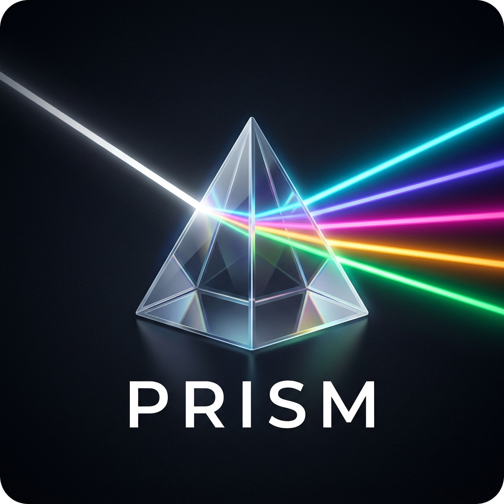
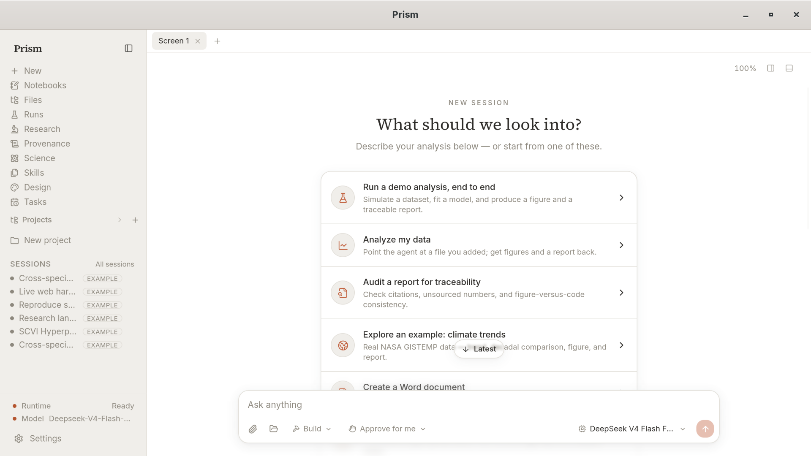
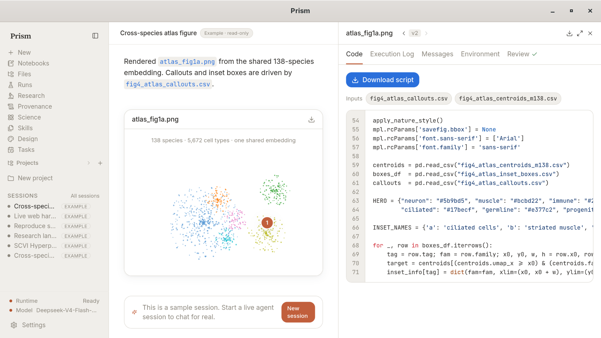
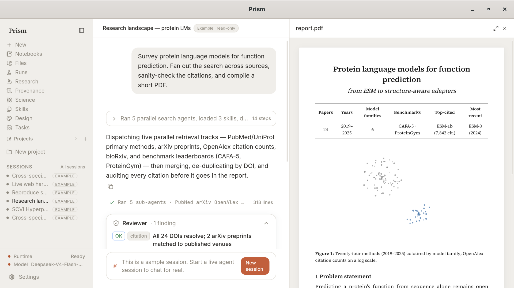
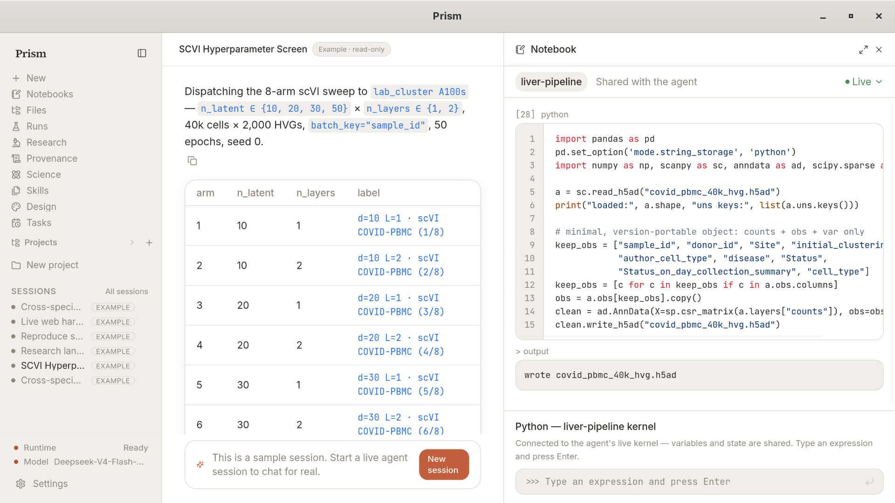
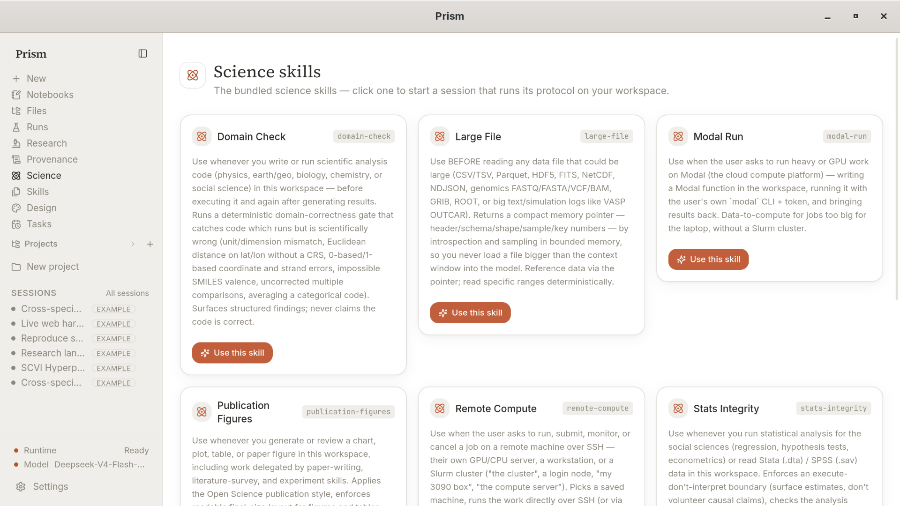
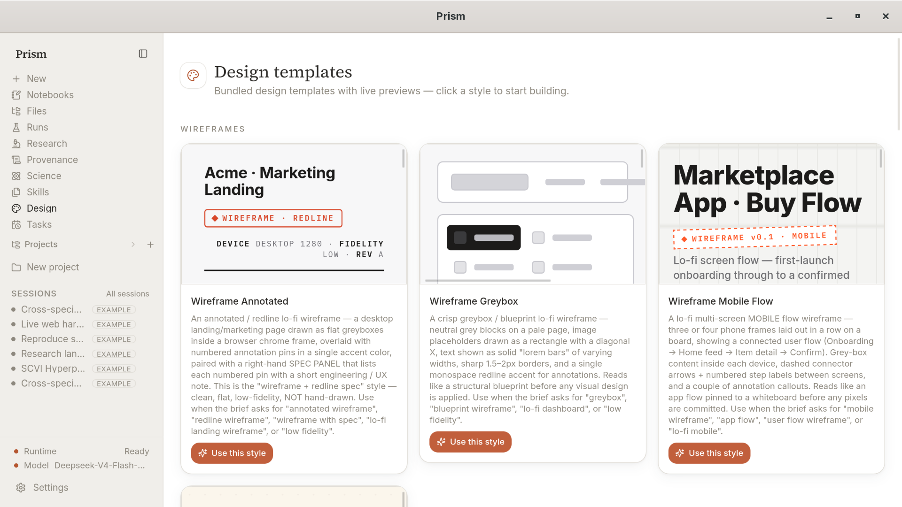
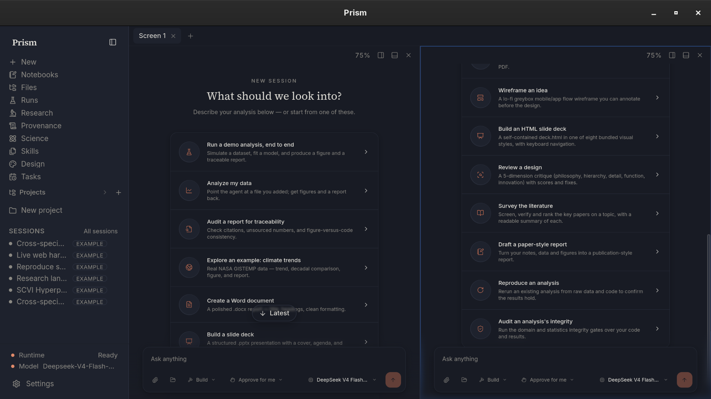
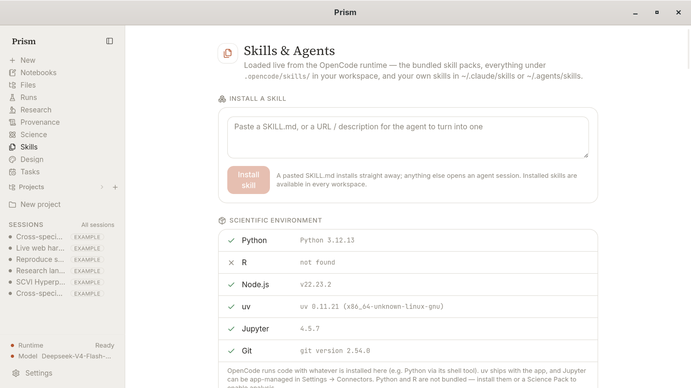

<div align="center">

  

  # Prism

  ### **Light bent into work.**

  *A local-first, model-agnostic AI workspace that refracts your questions across agents, notebooks, files, figures, reports, and review — each a different color of the same thought.*

  <p align="center">
    <a href="./README.md"><b>English</b></a> ·
    <a href="./README.zh.md">简体中文</a> ·
    <a href="./README.ja.md">日本語</a> ·
    <a href="./README.es.md">Español</a> ·
    <a href="./README.de.md">Deutsch</a> ·
    <a href="./README.fr.md">Français</a> ·
    <a href="./README.ko.md">한국어</a> ·
    <a href="./README.ar.md">العربية</a>
  </p>

  <p align="center">
    <a href="./LICENSE"></a>
    
    
    
  </p>

  <br />

  

</div>

---

## 🌟 What is Prism?

Prism is an open-source, local-first desktop AI workspace designed for scientists, engineers, designers, and thinkers. You ask a question or state a goal; Prism bends it through every tool you have — autonomous agents, live notebooks, local files, real browsers, and remote compute nodes — returning not just an answer, but the entire spectrum of actionable results:

* **Figures & Visualizations** — Vector plots, interactive atlas figures, and publication-ready charts.
* **Reproducible Code & Notebooks** — Executable Python/R scripts, Jupyter kernel integration, and data pipelines.
* **Publication-Quality Reports** — PDF and Markdown documents complete with DOIs, verified citations, and methodology audits.
* **Full Provenance & Audit Logs** — Every output traces directly back to the exact code, model parameters, and raw inputs that created it.

> **One Input. Every Wavelength.**
> * A research question becomes a literature survey, an experiment, a figure, and a paper.
> * A design brief becomes interactive prototypes, wireframes, specs, and presentation decks.
> * A data problem becomes exploratory analysis, clean datasets, live notebooks, and an executive report.
> * A software task becomes agent workflows, local code edits, automated tests, and documentation.

---

## 📐 Why "Prism"?

A optical prism takes a single ray of white light and reveals that it was always composed of many distinct wavelengths. 

Similarly, Prism takes a single prompt or hypothesis and refracts it across specialized AI agents, analytical skills, and computational tools — giving each facet of your thought the dedicated focus it requires while keeping everything unified in one local workspace.

---

## 📸 Visual Tour & Capabilities

### 1. Intelligent Workspace & Guided Workflows
Start from a single prompt or pick from curated scientific and creative starter tasks. Prism configures agent runtime modes (Manual Approval vs. Autonomous) and supports bring-your-own-model providers.



---

### 2. Interactive Figures & Code Execution
Inspect generated visual artifacts alongside their underlying execution code, input datasets, and runtime environment logs. Tweak parameters live and re-render figures instantly.



---

### 3. Automated Literature Survey & PDF Generation
Fan out literature searches across arXiv, PubMed, UniProt, and bioRxiv. Prism automatically de-duplicates papers, audits DOI citations, and compiles publication-formatted PDF reports.



---

### 4. Shared Live Notebooks & Kernel Integration
Run code seamlessly alongside the agent. Prism maintains active Python/Jupyter kernel sessions, allowing variables and dataframes to be inspected or edited interactively.



---

### 5. Pluggable Science Skills & Domain Gates
Access a library of domain-specific skills including **Domain Check** (catching unit/coordinate errors), **Large File Introspection** (HDF5/Parquet/VCF), **Stats Integrity**, and **Modal/Remote Compute**.



---

### 6. Design & Prototyping Templates
Turn design briefs into annotated wireframes, lo-fi greybox blueprints, mobile app user flows, and HTML presentation decks with live side-by-side previews.



---

### 7. Tile-able Multi-Screen Layouts & Dark Mode
Run multiple agent sessions simultaneously. Tile screens side-by-side, assign different models to each pane, and switch smoothly between high-contrast Dark Mode and light themes.



---

### 8. System Environment Detection & Skill Management
Prism automatically detects local Python, Node.js, `uv`, Jupyter, and Git environments, allowing you to install custom `SKILL.md` packages or MCP servers in seconds.



---

## 🔬 Research Loop

Prism encapsulates the scientific method into a chain of autonomous skill stages:

| Stage | Action | Output |
| :--- | :--- | :--- |
| **Explore** | Refine broad ideas into concrete, testable hypotheses | Topic matrix, literature pre-survey |
| **Survey** | Search and synthesize academic literature | 6–20 page PDF report, 60+ verified citations |
| **Experiment** | Formulate analysis scripts, clean datasets, and run models | Executable code, data tables, figures, provenance log |
| **Write** | Draft publication-grade manuscript | 8–14 page PDF paper, LaTeX output, figure callouts |

---

## 🔌 Scientific Connectors & MCP Tools

Connect directly to domain-specific databases and computational tools out of the box:

* **Literature & Citation**: arXiv, PubMed, Crossref, Semantic Scholar, bioRxiv / medRxiv
* **Biomedical & Life Sciences**: ClinicalTrials.gov, MyVariant, ClinVar, UniProt
* **Materials Science**: Materials Project API
* **Economics & Finance**: FRED (Federal Reserve Economic Data)
* **Earth & Space**: Open-Meteo Weather, USGS Water Data, NOAA Space Weather
* **Custom Extensibility**: Plug in any Model Context Protocol (MCP) server or local shell script via Settings.

---

## ⚡ Installation

Download pre-built binaries for your platform from the [Releases Page](https://github.com/bmo1177/Prism/releases/latest).

| Platform | Format / Package |
| :--- | :--- |
| **macOS** | `.dmg` / `.app` (Universal: Apple Silicon & Intel) |
| **Windows** | `.exe` installer / `.msi` |
| **Linux** | `.deb` / `.rpm` / `.AppImage` |

### Linux Command Line Quick Start:

```bash
# Debian / Ubuntu (.deb)
sudo apt install ./Prism_*.deb

# Fedora / RHEL (.rpm)
sudo rpm -i Prism-*.rpm

# AppImage (Universal)
chmod +x Prism_*.AppImage
./Prism_*.AppImage
```

---

## 🛠️ Build from Source

### Prerequisites
* **Node.js**: ≥ 20.x
* **pnpm**: 9.x
* **Rust Toolchain**: Stable (`cargo`, `rustc`)
* **Tauri 2 System Dependencies**: (See [Tauri Prerequisites](https://v2.tauri.app/start/prerequisites/))

### Steps

```bash
# 1. Clone repository
git clone https://github.com/bmo1177/Prism.git
cd Prism

# 2. Install dependencies
pnpm install

# 3. Fetch bundled runtime sidecars & default skills
bash scripts/dev/fetch-opencode.sh
bash scripts/dev/fetch-uv.sh
bash scripts/dev/fetch-skills.sh

# 4. Launch development environment
pnpm --filter @ai4s/desktop tauri dev

# 5. Build production desktop release
pnpm --filter @ai4s/desktop tauri build
```

---

## 🛡️ Safety & Local-First Guarantees

* 🔒 **Local Workspace Isolation**: The agent strictly accesses the open project workspace directory.
* 🛡️ **Execution Approval**: Commands, file deletions, dependency installs, and network calls require explicit user approval by default.
* 🗝️ **Secure Credentials**: API keys are stored securely in OS credential storage / local app config — never exported into git, crash reports, or provenance files.
* 📊 **Transparent Data Flow**: Settings provides a clear plain-language view of all network activity and model interactions.

---

## 📂 Repository Architecture

```
Prism/
├── apps/
│   └── desktop/          # Tauri 2 Rust wrapper & React frontend shell
├── packages/
│   ├── sdk/              # OpenCodeClient runtime wrapper
│   ├── shared/           # Common types, schemas, and color palettes
│   └── ui/               # Shared UI component system
├── runtime/
│   ├── skills/           # Bundled & external agent skills
│   ├── mcp/              # Model Context Protocol integrations
│   └── harness/          # Agent execution context & prompts
├── assets/               # Branding graphics, logos, and screenshots
├── examples/             # Built-in demo projects (e.g. bci-trends)
├── scripts/              # Development, fetching, and build scripts
└── docs/                 # Product specifications and PRD
```

---

## 📜 Citation

If you use Prism in your research or academic work, please cite:

```bibtex
@software{prism2026,
  author       = {{The Prism Contributors}},
  title        = {Prism: Light bent into work},
  year         = {2026},
  publisher    = {GitHub},
  journal      = {GitHub repository},
  howpublished = {\url{https://github.com/bmo1177/Prism}},
  version      = {0.3.3},
  license      = {MIT}
}
```

---

## 📄 License

Distributed under the [MIT License](./LICENSE).

> *Prism is local-first AI software. Always verify generated figures, code execution, and citations before publication.*
